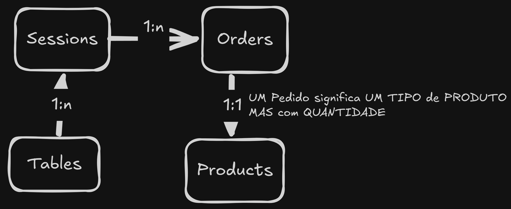

# API-REST: SISTEMA RESTAURANTE

## Como funciona o projeto

O projeto é uma API de um sistema de restaurante, onde funcionará através de **SESSÕES** que são **ABERTAS** e **FECHADAS** nas **MESAS**, e enquanto abertas os **PEDIDOS** feitos são redirecionados para as *SESSÕES* que estiverem *ABERTAS*.

Exemplo: Um cliente chega no restaurante, ele escolhe uma mesa, eu abro uma *SESSÃO* para ele (através do número da mesa), ao abrir uma sessão, a mesa fica indisponível (até a sessão atual ser fechada), pois uma mesa só aceitar 1 sessão por vez, então o cliente começa a fazer *PEDIDOS*, esses pedidos são atrelados/vinculados a sessão que está aberta, e cada *PEDIDO* contém **UM TIPO** de **PRODUTO** e a **QUANTIDADE** do mesmo, exemplo (Pizza Calabresa - 3 unidades).

## Como instalar e rodar o projeto

1 - Execute um `git clone git@github.com:AndreyMateus/API-REST-RESTAURANTE.git` **OU** baixe o projeto via .rar/.zip e descompacteo.

2 - Entre no projeto via **CLI(COMMAND LINE INTERFACE / TERMINAL)**

3 - Execute o comando `npm install` **OU** `npm i`

4 -  Rode o script para iniciar o projeto com `npm run dev`

5 - **(opcional)** - Verifique no console se não houve erros.

## Endpoints da API (EM PRODUÇÃO, também haverá documentação via ARQUIVO INSOMINA e SWAGGER)

### Mesas

| Método | Rota         | Descrição                     |
| ------ | ------------ | ------------------------------|
| GET    | `/`     | Lista todos        |
| GET    | `/:`  | Lista       |
| POST   | `/`     | Cria         |
| PUT    | `//:id` | Atualiza |
| DELETE | `//:id` | Remove    |

### Pedidos

| Método | Rota         | Descrição                     |
| ------ | ------------ | ------------------------------|
| GET    | `/`     | Lista todos        |
| GET    | `/:`  | Lista       |
| POST   | `/`     | Cria         |
| PUT    | `//:id` | Atualiza |
| DELETE | `//:id` | Remove    |

### Produtos

| Método | Rota         | Descrição                     |
| ------ | ------------ | ------------------------------|
| GET    | `/`     | Lista todos        |
| GET    | `/:`  | Lista       |
| POST   | `/`     | Cria         |
| PUT    | `//:id` | Atualiza |
| DELETE | `//:id` | Remove    |

### Sessões

| Método | Rota         | Descrição                     |
| ------ | ------------ | ------------------------------|
| GET    | `/`     | Lista todos        |
| GET    | `/:`  | Lista       |
| POST   | `/`     | Cria         |
| PUT    | `//:id` | Atualiza |
| DELETE | `//:id` | Remove    |

## Arquitetura do Projeto (terá descrição em breve)

### controllers

### database

### middlewares

### routes

### utils
